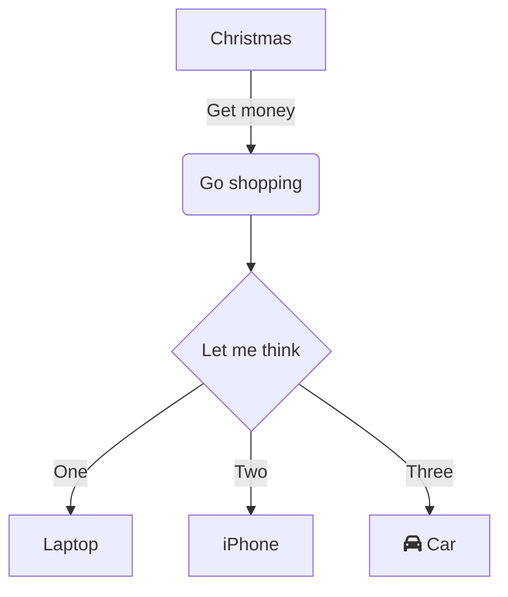
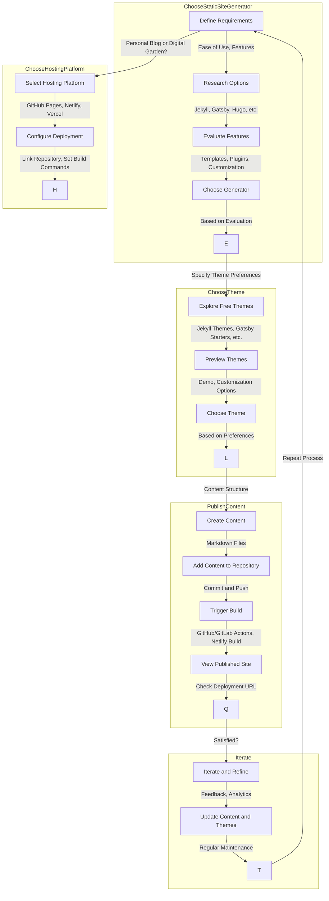

## Phong cách

### Giao diện
- Digital Garden: ghi chú không chuyên nghiệp, tập trung vào ý tưởng và liên kết. Thúc đẩy hình thành thói quen viết, không cầu toàn về hoàn thiện.
- Blog: Chỉn chu, chuyên nghiệp về nội dung và hình thức. Tối ưu cho máy tìm kiếm để có traffic về blog.
- Trang tài liệu: trình bày các tài liệu kỹ thuật, hướng dẫn sử dụng sản phẩm. Giao diện thường đơn giản, tập trung vào nội dung chính về hướng dẫ

### Trình bày nội dung
- Thuần ghi chú cơ bản văn xuôi với markdown, chèn ảnh và media
- Ghi chú khoa học với công thức toán học, cần dùng Latex, code

## Tính năng cân nhắc

- Tìm kiếm
- Markdown
- Wikilink, Tag
- Graph View
- Blog Style

## Quy trình lựa chọn
- Kiến trúc hệ thống: 

